### ▸ selected work

  <a href="https://github.com/doyled-it/agent-view"></a>
  <a href="https://github.com/doyled-it/claude-vault-skills"></a>
  <a href="https://github.com/janus-llm/janus-llm"></a>
  <a href="https://github.com/mitrefireline/simfire"></a>

  <a href="https://doyled-it.com/words">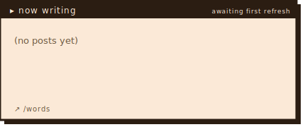</a>
  <a href="https://doyled-it.com/music">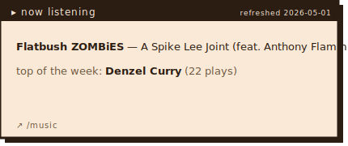</a>

### ▸ elsewhere

  <a href="https://doyled-it.com">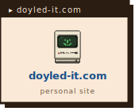</a>
  <a href="https://doyled-it.com/music">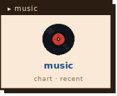</a>
  <a href="https://doyled-it.com/card">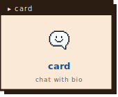</a>
  <a href="https://linkedin.com/in/michaeldoyleml">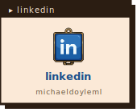</a>
  <a href="mailto:michaeldoyle1994@gmail.com">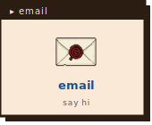</a>

